# Superstore Sales Analysis

## Project Overview
This project performs an end-to-end sales analysis using the Superstore dataset. The goal is to identify business insights, customer behavior, seasonal trends, and top-performing products using Python.

## Objectives
- Analyze overall sales performance
- Identify seasonal trends
- Find top customers and customer segments
- Discover best-selling and least-selling products
- Visualize sales patterns
- Apply time series trend analysis

## Tools & Libraries
- Python
- Pandas
- NumPy
- Matplotlib
- Seaborn
- Scikit-learn

## Key Analysis Performed
- Data cleaning and preprocessing
- Missing value handling
- Feature engineering (Year, Month, Quarter)
- Sales analysis by category and region
- Customer segmentation analysis
- Top and least selling products
- Sales heatmap for seasonal trend detection
- Moving average for trend smoothing
- Linear regression for basic forecasting

## Key Insights
- Sales increase in the last quarter of the year
- Technology category generates highest revenue
- Consumer segment dominates customer base
- Top customers contribute significantly to sales
- Seasonal demand visible in Q4
- Some products show very low sales performance

  ## Data Visualizations

Below are the key visualizations created during the analysis.

---

## 1. Sales by Category, Sub-Category, and Region
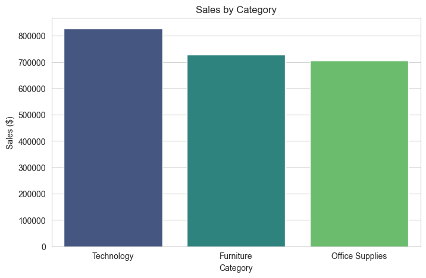
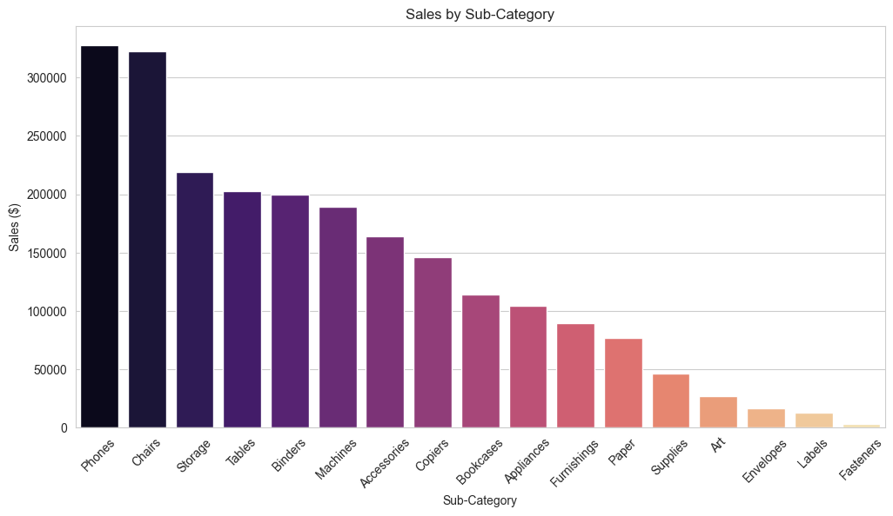
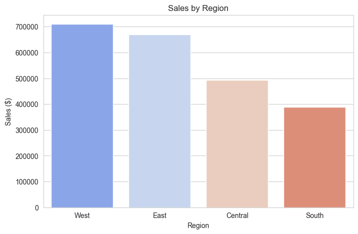

---

## 2. Top 10 Selling Products
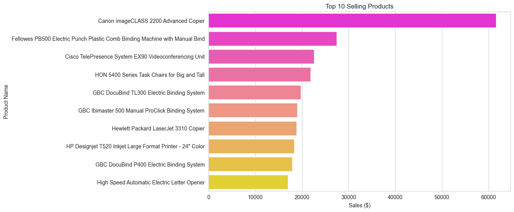

---

## 3. Least Selling Products
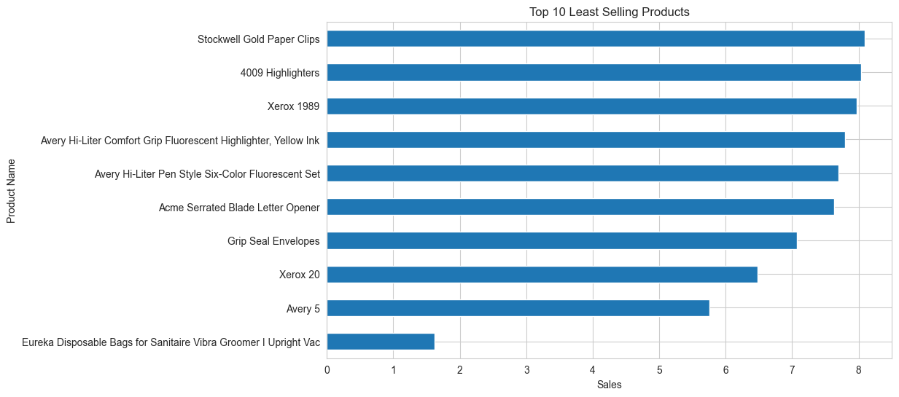

---

## 4. Monthly Sales Trend
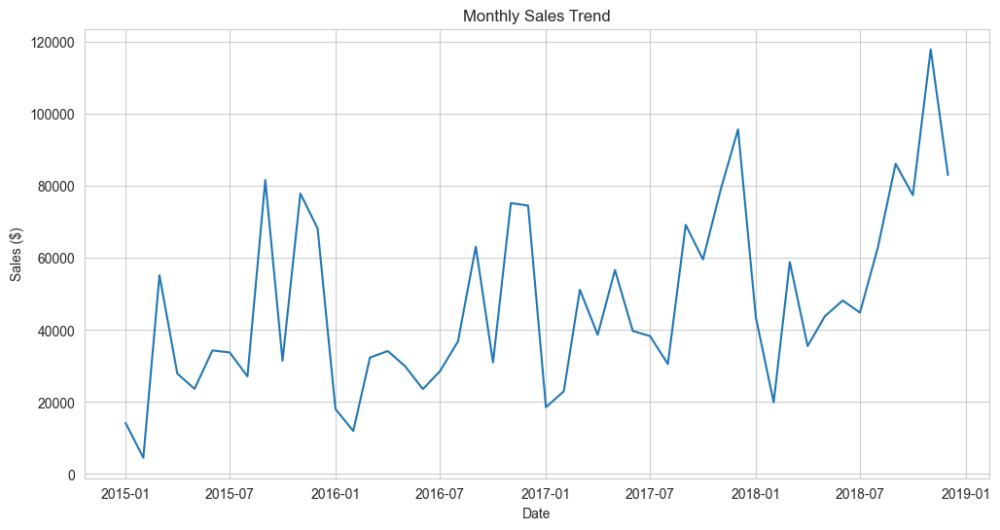

---

## 5. Moving Average Trend (3-Month)
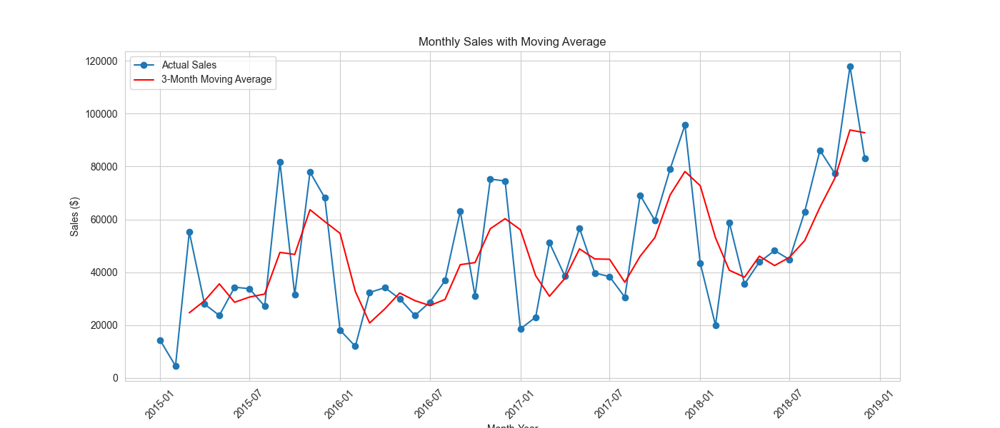

---

## 6. Linear Regression Forecast
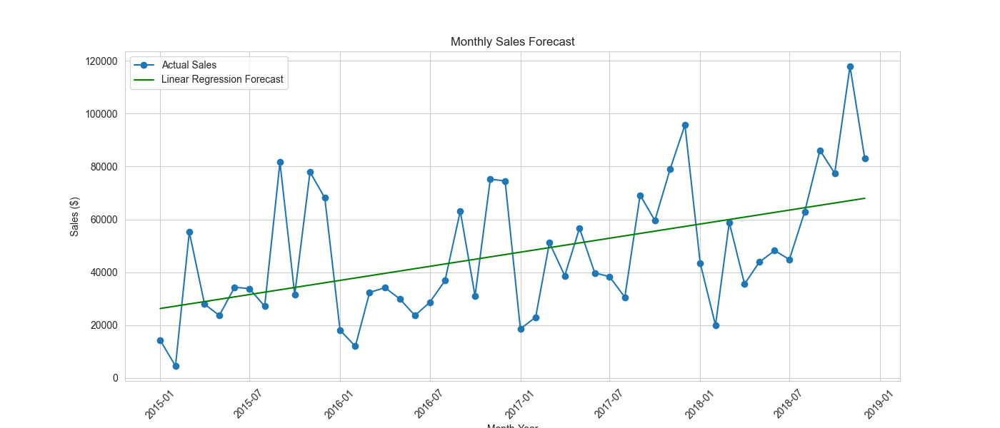

---

## 7. Sales Heatmap (Year vs Month)
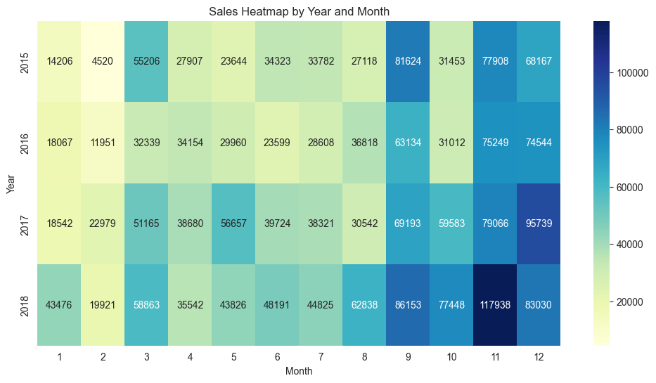

---

## 8. Customer Analysis

### Customer Segments
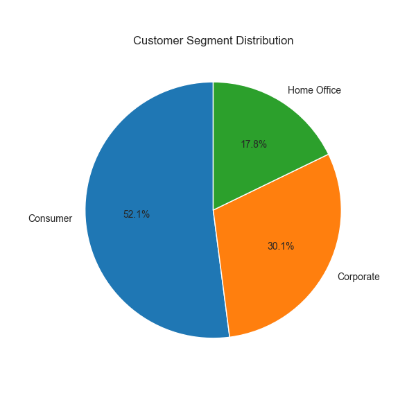

### Top Customers
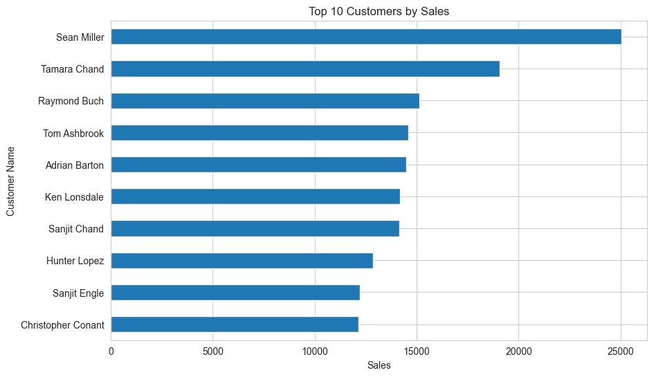

## Project Structure
- analysis.ipynb
- Superstore.csv
- README.md
- visualizations

## Future Improvements
- Profit analysis (if dataset available)
- Advanced forecasting models
- Dashboard using Power BI or Tableau

## Author
Yara — Data Analyst   

---

# Superstore Verkaufsanalyse (Deutsch)

## Projektübersicht
Dieses Projekt beinhaltet eine vollständige Verkaufsdatenanalyse mit dem Superstore-Datensatz. Ziel ist es, geschäftliche Erkenntnisse, Kundenverhalten und saisonale Trends mit Python zu identifizieren.

## Ziele
- Analyse der Gesamtumsätze
- Identifikation saisonaler Trends
- Top-Kunden erkennen
- Kunden-Segmentierung analysieren
- Best- und schwachverkaufte Produkte finden
- Visualisierung von Verkaufsmustern

## Verwendete Tools
- Python
- Pandas
- NumPy
- Matplotlib
- Seaborn
- Scikit-learn

## Wichtigste Erkenntnisse
- Umsätze steigen im letzten Quartal des Jahres
- Technologie-Kategorie generiert den höchsten Umsatz
- Consumer-Segment dominiert
- Saisonale Nachfrage im Q4 sichtbar
- Einige Produkte zeigen sehr geringe Verkaufszahlen

## Autor
Yara — Data Analyst
